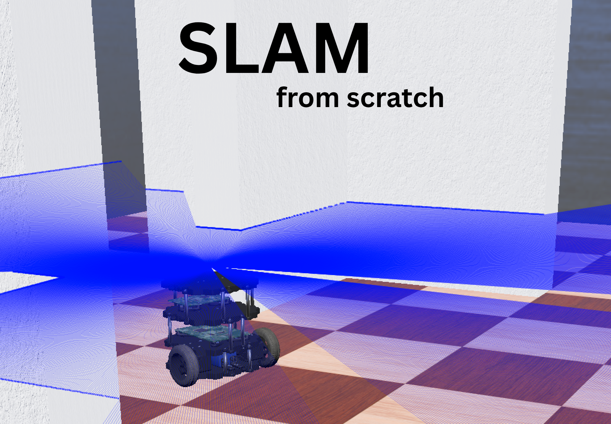

# SLAM from scratch

A from-scratch implementation of a graph-based SLAM (Simultaneous Localization and Mapping) algorithm, written in C++. The purpose of this project is to learn the mathematics and logic behind graph-based SLAM, and to get practice designing, implementing, and testing a complicated algorithm end to end.

Webots is used as the robot simulation front end, with a TurtleBot driving through an environment while the SLAM system processes sensor data in real time.



 
---

## Project Structure

```
slam-lab/
├── slam_core/              # Core C++ SLAM implementation
│   ├── src/                # Source files (ICP, odometry, pose graph, occupancy grid, etc.)
│   ├── tests/              # Unit and integration tests for SLAM components
│   └── build/         
├── webots/                 # Webots simulation setup
│   ├── controllers/    
│   ├── worlds/        
│   └── ...           
├── Visualizers/            # Pygame-based visualization tools for SLAM output
│   ├── slam_viewer_pygame.py
│   └── slam_grid_viewer.py
├── configs/                # Sensor/robot config files (intel.json, turtlebot.json)
├── CARMEN_testing/         # CARMEN log files and replay script for offline testing
├── ResultVideos/           # Recorded demo videos of SLAM runs
├── report/                 # Report writing files
├── HandwrittenNotes/       # Personal notes studying SLAM
├── ProgressPics/           # Screenshots and figures
└── requirements.txt   
```
https://github.com/user-attachments/assets/88a78228-28e5-4d2f-b41d-d8b17d0dba2c

### Key Components (`slam_core/src/`)

| File | Description |
|---|---|
| `icp_matcher` | ICP (Iterative Closest Point) scan matching |
| `odometry` | Wheel odometry integration |
| `PoseGraph` | Pose graph construction and management |
| `feature_extractor` | Laser scan feature extraction |
| `occupancy_grid` | 2D occupancy grid mapping |
| `lidar_processor` | Raw lidar data processing |
| `zmq_bridge` | ZeroMQ bridge for inter-process communication |

---

## AI Usage

AI tools were used selectively in this project:

- **Testing code**: Test scaffolding and test cases were generated with AI assistance.
- **Visualization code**: The Pygame viewers in `Visualizers/` were built with AI help.
- **Syntax help**: AI was used for C++ syntax questions and general language guidance.
- **Algorithm explanation**: AI was used to explain the theory behind SLAM (pose graph optimization, ICP, etc.) for me to then implement independently.

All core algorithm code in `slam_core/src/` was written by hand.
